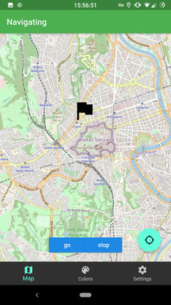

# Hatlight-app
##### Companion app for a smart hat

This is companion app for hatlight - a smart hat with bluetooth, LEDs and compass

Thought this app, you can controll color to set on LEDs, or you can set up navigation

### Navigation
Navigation works by showing you what azimuth you should head to get to your destination.
You select destination in app, and then it periodically checks where is it relatively to you, and sends it to the hat. Hat then points the right direction by lighting one of the LEDs

### The Hat
More about the hat itself is on it's own repo:
https://github.com/TheLastGimbus/Hatlight-ESP32

### TODO:
 - [ ] Add animations
